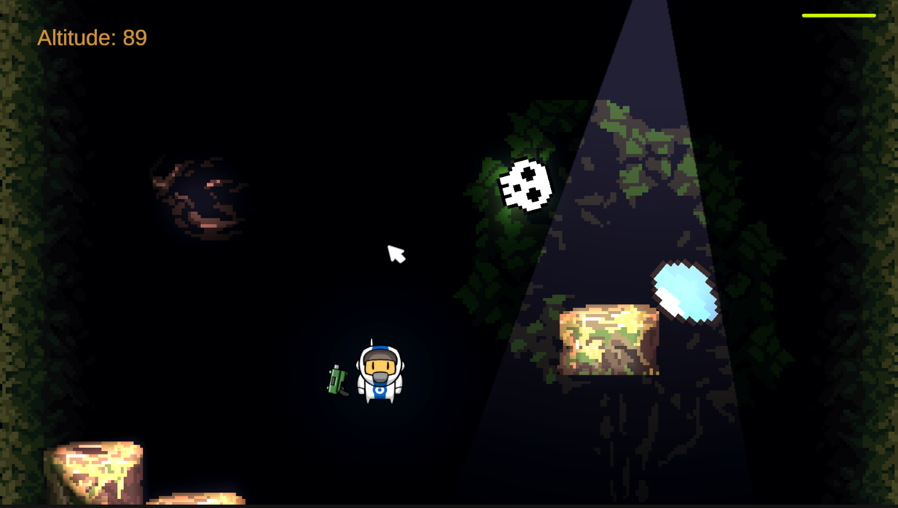
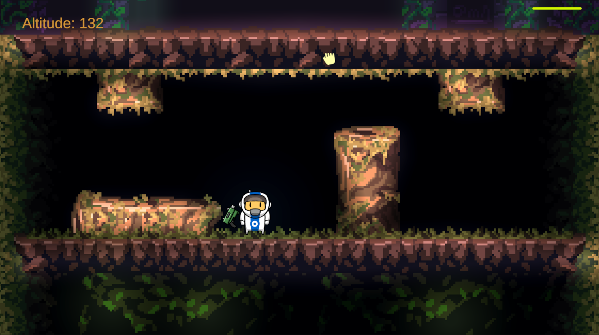
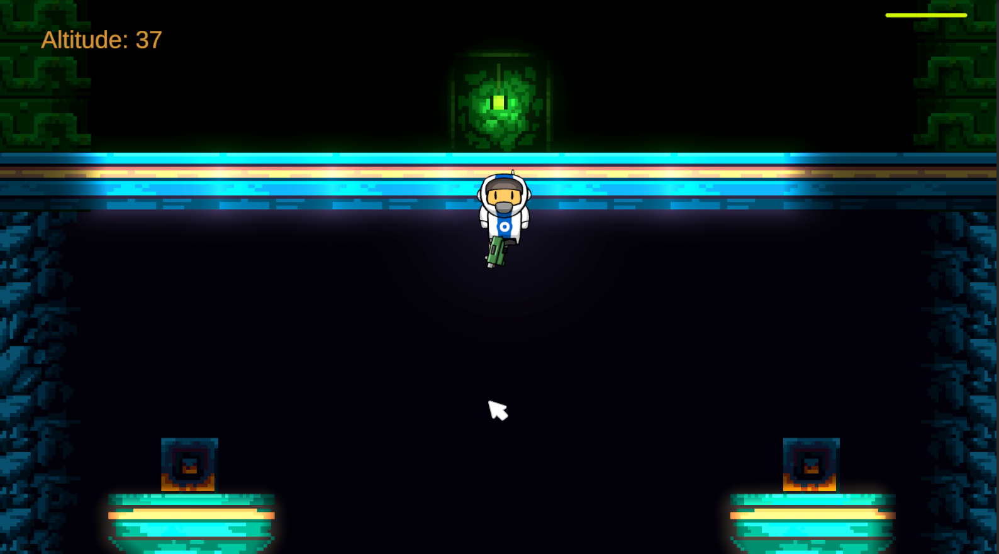
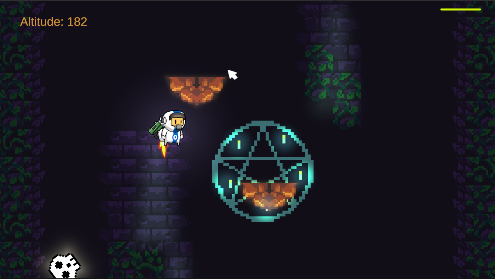
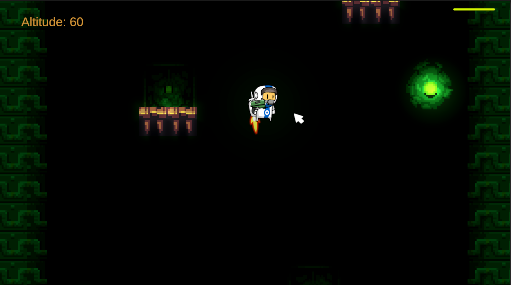

# Astronaut Platformer 🚀

**🎮 [Play on itch.io](https://srtortugga.itch.io/astronautplatformer)**

A thrilling 2D vertical scrolling platformer where you play as an astronaut equipped with a grappling hook gun, navigating through challenging levels filled with dynamic platforms and items that affect your abilities.

## 🌟 Game Description

Astronaut Platformer is an action-packed 2D platformer that combines traditional jumping mechanics with innovative grappling hook gameplay. Navigate through vertically scrolling levels as a space-suited adventurer, using your jetpack for mobility and your grappling hook gun to reach distant platforms.

The game features multiple types of platforms with unique behaviors, from disappearing and reappearing platforms to moving platforms that challenge your timing and precision. Collect items that can either boost your abilities or present dangerous challenges that require quick thinking to overcome.

## 🎯 Key Features

- **Grappling Hook Mechanics**: Shoot hooks up to 10 meters to attach to platforms and swing across gaps
- **Dynamic Jetpack System**: Energy-based flight system with visual and audio feedback
- **Interactive Platforms**: Multiple platform types including disappearing, moving, and low-friction surfaces
- **Item System**: Collectible items that modify player abilities, both positively and negatively
- **Atmospheric Audio**: Classic arcade-inspired soundtrack featuring tracks from Metal Slug and Contra
- **Visual Feedback**: Smart cursor changes and lighting effects when platforms are within grappling range

## 🎮 Controls

### Input Instructions:
- **Left Click**: Shoot the grappling hook
- **A / D Keys**: Move sideways (walking/flying horizontally)
- **Space**: Jump/Activate jetpack
- **Esc**: Return to main menu
- **Mouse Movement**: Aim your grappling hook gun
- **Right Click**: Detach grappling hook

### Gameplay Mechanics:
- Your astronaut automatically faces the direction of your mouse cursor
- Walking is possible when not using the jetpack (horizontal movement only)
- Jumping automatically detaches any active grappling hook
- Energy system limits jetpack usage with regeneration over time
- Items provide temporary effects that can help or hinder your progress

## 📸 Screenshots

*Early level gameplay showing basic platforming*

*Advanced level with moving platforms and grappling hook mechanics*

*Dynamic lighting effects and environmental interaction*

*Item collection and special platform types*

*Complex level design with multiple platform varieties*

## 🛠️ Technical Details

- **Engine**: Unity 2022.3.5f1
- **Platform**: PC (Windows/Mac/Linux)
- **Genre**: 2D Platformer, Action
- **Art Style**: Pixel Art
- **Input System**: Keyboard + Mouse

## 📋 Platform Types

- **Level 1-2**: Standard static platforms
- **Level 3**: Disappearing/reappearing platforms with random intervals
- **Level 4**: Horizontally moving platforms (players move with them)
- **Level 5**: Moving platforms with low-friction materials

## 🎒 Items

- **💧 Water Item**: Increases energy regeneration rate (+0.1)
- **💣 Bomb Item**: Applies downward force and briefly paralyzes the player
- **💀 Skull Item**: Decreases energy regeneration rate (-0.1) and causes temporary paralysis

## 📝 Development Notes

This project showcases clean C# scripting practices with organized code structure, efficient component references, and polished game feel. The input system is designed for intuitive control while providing depth through the grappling hook mechanics.

For detailed development history and recent changes, see [CHANGELOG.md](CHANGELOG.md).

## 🔗 Links

- **[Play the Game](https://srtortugga.itch.io/astronautplatformer)** - Available on itch.io
- **[Changelog](CHANGELOG.md)** - Development history and updates

---

*Developed with Unity 2022.3.5f1 | Press Space to Continue Your Adventure!*
